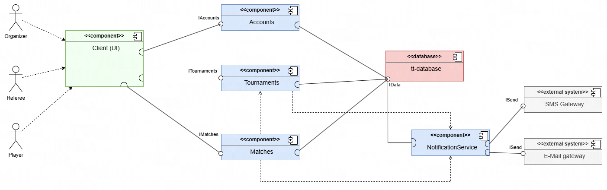
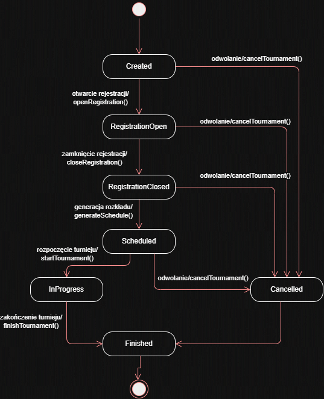
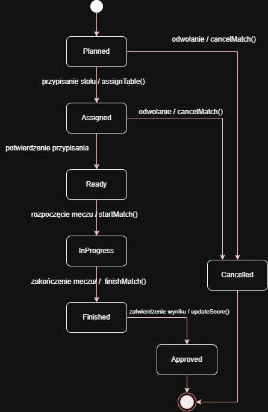
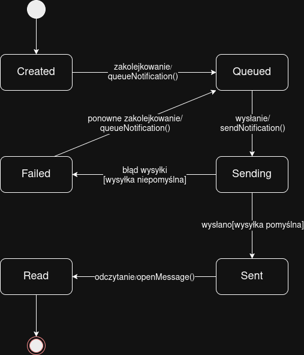
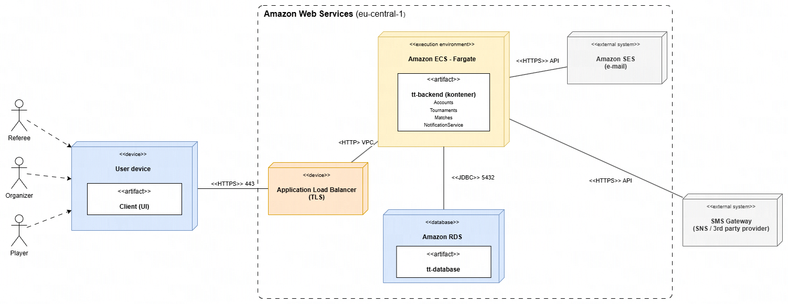
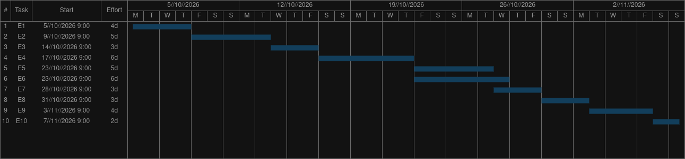

| Wydział Informatyki Politechniki Białostockiej   Inżynieria Oprogramowania Informatyka, Semestr IV, PS #1                              | Data przekazania:                            |
| ----------------------------------------------------------------------------------------------------------------------------------------------- | -------------------------------------------- |
| **Projekt**: System zarządzania zawodami w tenisa stołowego **Zespół**: - Marcel Alefierowicz - Przemysław Dudek - Michał Burzyński | **Prowadzący**: dr. inż Marcin Czajkowski |

**Repozytorium GitHub:** [tt-controllah](https://github.com/ComradeHonk/tt-controllahh)

# 1. Treść zadania

Celem projektu jest zaprojektowanie systemu informatycznego wspierającego organizację zawodów w tenisa stołowego. System ma usprawnić proces zarządzania turniejami poprzez automatyzację planowania rozgrywek, obsługi uczestników oraz publikacji wyników.

Zakres projektu obejmuje funkcjonalności związane z tworzeniem i konfiguracją turniejów, rejestracją zawodników oraz generowaniem harmonogramu meczów. System umożliwia automatyczne tworzenie drabinek turniejowych (np. pucharowych lub grupowych), przypisywanie spotkań do dostępnych stołów oraz zarządzanie przebiegiem rozgrywek w czasie rzeczywistym. Dodatkowo przewiduje się możliwość wprowadzania wyników meczów przez sędziów oraz ich natychmiastową aktualizację w systemie.

Projekt obejmuje także funkcje przeglądania harmonogramu, sprawdzania wyników oraz informowania uczestników o nadchodzących meczach i zmianach organizacyjnych. System ma wspierać organizatora w nadzorowaniu przebiegu zawodów oraz zapewniać uczestnikom szybki dostęp do aktualnych informacji.

# 2. Cel, zakres, kontekst i korzyści

## 2.1. Cel budowania systemu

Celem projektowanego systemu jest stworzenie narzędzia informatycznego wspierającego planowanie oraz zarządzanie zawodami w tenisa stołowego. 

System ma umożliwiać sprawną organizację turniejów poprzez automatyzację kluczowych procesów, takich jak rejestracja zawodników, tworzenie harmonogramu rozgrywek, zarządzanie meczami oraz publikacja wyników. Głównym założeniem jest eliminacja problemów wynikających z ręcznego zarządzania zawodami (np. błędów w harmonogramie, opóźnień, braku aktualnych informacji), a także zwiększenie przejrzystości i efektywności organizacyjnej.

## 2.2. Zakres systemu

### 2.2.1. Zakres funkcjonalny

**System obejmuje następujące funkcjonalności:**

- tworzenie i konfiguracja turniejów (np. typ rozgrywek, liczba stołów),
- rejestracja i zarządzanie zawodnikami,
- generowanie drabinek turniejowych (pucharowych, grupowych),
- automatyczne planowanie harmonogramu meczów,
- przypisywanie meczów do stołów i przedziałów czasowych,
- wprowadzanie i zatwierdzanie wyników meczów,
- aktualizacja drabinki i postępu turnieju w czasie rzeczywistym,
- przegląd harmonogramu i wyników przez użytkowników,
- wysyłanie powiadomień o meczach i zmianach,
- generowanie raportów końcowych.

### 2.2.2. Zakres niefunkcjonalny
- dostępność systemu w trakcie zawodów (wysoka niezawodność),
- czas odpowiedzi systemu poniżej 2 sekund,
- obsługa wielu użytkowników jednocześnie,
- bezpieczeństwo danych użytkowników,
- dostępność na urządzeniach mobilnych.

## 2.3. Kontekst systemu

System funkcjonuje jako centralna platforma wspierająca organizację turnieju.

### 2.3.1. Aktorzy systemu (4):
1. Organizator – zarządza turniejem i jego przebiegiem  
2. Zawodnik – uczestniczy w zawodach i przegląda informacje  
3. Sędzia – wprowadza wyniki meczów  
4. System powiadomień – wysyła komunikaty do użytkowników  

System może współpracować z zewnętrznymi usługami (np. e-mail/SMS) w celu realizacji powiadomień.

## 2.4. Przewidywalne mierzalne korzyści

### 2.4.1. Skrócenie czasu przygotowania turnieju

- przed wdrożeniem: 4–6 godzin  
- po wdrożeniu: ok. 30 minut  

### 2.4.2. Redukcja liczby błędów w harmonogramie / podczas zapisywania użytkowników

- metryka: liczba błędów / turniej  
- przed: 10–15  
- po: 0–2  

### 2.4.3. Skrócenie czasu publikacji wyników

- przed: 10–15 minut  
- po: <10 sekund  

### 2.4.4. Wzrost liczby obsługiwanych zawodników

- przed: 64 zawodników  
- po: 96 zawodników  

## 2.5. Niemierzalne korzyści

- poprawa organizacji i przejrzystości zawodów,
- zwiększenie satysfakcji uczestników,
- lepsza komunikacja między organizatorem a zawodnikami,
- większy profesjonalizm wydarzenia,
- łatwiejsze zarządzanie przebiegiem turnieju w czasie rzeczywistym.

# 3. Słownik

- **Turniej** 
Zdarzenie sportowe obejmujące zestaw rozgrywek pomiędzy zawodnikami według określonego systemu.

- **Zawodnik** 
Osoba biorąca udział w turnieju.

- **Klub** 
Jednostka organizacyjna zrzeszająca zawodników.

- **Mecz** 
Jednostka rywalizacji pomiędzy dwoma zawodnikami. Składa się z setów.

- **Set** 
Część meczu, rozgrywana do określonej liczby punktów (np. 11).

- **Punkt** 
Najmniejsza jednostka punktacji przyznawana w trakcie seta.

- **Wynik meczu** 
Rezultat meczu wyrażony najczęściej liczbą wygranych setów przez zawodników.

- **Faza turnieju** 
Logiczny etap turnieju (np. grupowa, pucharowa).

- **Grupa** 
Zbiór zawodników w fazie grupowej, rywalizujących systemem „każdy z każdym”.

- **Runda** 
Etap w fazie pucharowej (np. ćwierćfinał, półfinał).

- **Drabinka turniejowa** 
Struktura odwzorowująca przebieg fazy pucharowej i zależności między meczami.

- **System rozgrywek** 
Zasady organizacji turnieju (np. grupowy, pucharowy, mieszany).

- **Ranking** 
Uporządkowana lista zawodników według wyników lub punktów.

- **Rozstawienie (seedowanie)** 
Przypisanie zawodników do pozycji startowych w drabince na podstawie rankingu.

- **Walkower** 
Specjalny przypadek zakończenia meczu bez rozegrania.

- **Stół** 
Zasób fizyczny, na którym rozgrywany jest mecz.

# 4. Perspektywa przypadków użycia

## 4.1. Diagram przypadków użycia

### 4.1.1. Opis aktorów

**Organizator**

Organizator to główny użytkownik systemu odpowiedzialny za przygotowanie i nadzorowanie przebiegu turnieju. Tworzy i konfiguruje zawody, określając ich parametry (np. typ rozgrywek, liczba stołów), zarządza listą zawodników oraz inicjuje generowanie drabinek i harmonogramu meczów. W trakcie turnieju monitoruje jego przebieg, wprowadza ewentualne zmiany organizacyjne i dba o poprawność oraz aktualność danych. Ma najszersze uprawnienia w systemie.

**Zawodnik**

Zawodnik to uczestnik turnieju, który korzysta z systemu głównie w celu uzyskania informacji. Może zarejestrować się do zawodów, przeglądać harmonogram swoich meczów oraz sprawdzać wyniki i postęp turnieju. Otrzymuje również powiadomienia dotyczące nadchodzących spotkań i zmian organizacyjnych. Jego dostęp do systemu jest ograniczony do funkcji informacyjnych.

**Sędzia**

Sędzia odpowiada za obsługę meczów od strony wyników. Ma dostęp do listy przypisanych mu spotkań i wprowadza ich rezultaty do systemu. Może również zatwierdzać wyniki, co powoduje ich oficjalne uwzględnienie w drabince turniejowej. Jego działania mają bezpośredni wpływ na aktualizację przebiegu rozgrywek, dlatego wymagają odpowiedniej dokładności i terminowości.

**System powiadomień**

System powiadomień to aktor techniczny odpowiedzialny za komunikację z użytkownikami. Automatycznie wysyła informacje o nadchodzących meczach, zmianach w harmonogramie oraz wynikach spotkań za pośrednictwem zewnętrznych usług (np. e-mail lub SMS). Działa w tle i nie wymaga bezpośredniej interakcji ze strony użytkowników, ale odgrywa istotną rolę w zapewnieniu aktualności i dostępności informacji.

### 4.1.2. Opisy przypadków użycia

#### **Opis przypadku użycia „Rejestracja zawodnika do turnieju”** *(autor: Marcel Alefierowicz)*

**1. Uczestniczący aktorzy**

- Zawodnik

**2. Podstawowy ciąg zdarzeń**

- System wyświetla formularz rejestracji do turnieju,
- Zawodnik wprowadza wymagane dane (np. imię, nazwisko, dane kontaktowe),
- Zawodnik wybiera turniej, do którego chce się zapisać,
- Zawodnik zatwierdza formularz rejestracyjny,
- System weryfikuje kompletność i poprawność danych,
- System sprawdza dostępność miejsc w turnieju,
- System zapisuje zgłoszenie w bazie danych,
- System informuje o poprawnym zarejestrowaniu zawodnika.

**3. Alternatywne ciągi zdarzeń**

a) Dane są niekompletne lub niepoprawne
- System wyświetla formularz ponownie, wskazując błędne pola,
- Zawodnik poprawia dane i ponownie zatwierdza formularz,

b) Brak wolnych miejsc w turnieju
- System informuje o braku dostępnych miejsc,
- Zawodnik może wybrać inny turniej lub anulować operację,

c) Zawodnik rezygnuje z rejestracji
- System przerywa proces bez zapisywania danych.

**4. Zależności czasowe**

a) częstotliwość wykonania: zależna od liczby uczestników, zwykle kilkanaście–kilkadziesiąt razy na turniej 
b) przewidywane spiętrzenia: przed rozpoczęciem turnieju 
c) typowy czas realizacji: ~1–2 minuty 
d) maksymalny czas realizacji: nieokreślony 

**5. Wartości uzyskiwane przez aktora po zakończeniu przypadku użycia**
- Potwierdzenie rejestracji do turnieju,
- Zapis w systemie jako uczestnik zawodów,
- Możliwość udziału w rozgrywkach.

#### **Opis przypadku użycia „Wprowadzanie i zatwierdzanie wyników meczów”** *(autor: Michał Burzyński)*

**1. Uczestniczący aktorzy**

- Sędzia

**2. Podstawowy ciąg zdarzeń**

- System wyświetla listę meczów przypisanych do Sędziego,
- Sędzia wybiera zakończony mecz,
- System wyświetla formularz wprowadzania wyniku,
- Sędzia wprowadza wynik meczu,
- Sędzia zatwierdza wynik,
- System weryfikuje poprawność danych (np. format wyniku),
- System zapisuje wynik w bazie danych,
- System automatycznie aktualizuje drabinkę turniejową i status rozgrywek,
- System informuje o poprawnym zapisaniu wyniku.

**3. Alternatywne ciągi zdarzeń**

a) Wprowadzone dane są niepoprawne
- System wyświetla komunikat o błędzie i wskazuje niepoprawne pola,
- Sędzia poprawia dane i ponownie zatwierdza wynik,

b) Sędzia rezygnuje z wprowadzania wyniku
- System przerywa operację bez zapisywania danych.

**4. Zależności czasowe**

a) częstotliwość wykonania: wielokrotnie w trakcie turnieju 
b) przewidywane spiętrzenia: w końcowych fazach turnieju 
c) typowy czas realizacji: ~30 sekund 
d) maksymalny czas realizacji: nieokreślony 

**5. Wartości uzyskiwane przez aktora po zakończeniu przypadku użycia**

- Zapisany i zatwierdzony wynik meczu,
- Aktualizacja drabinki turniejowej,
- Informacja o poprawnym wykonaniu operacji.

#### **Opis przypadku użycia „Generowanie harmonogramu meczów”** *(autor: Przemysław Dudek)*

**1. Uczestniczący aktorzy**

- Organizator

**2. Podstawowy ciąg zdarzeń**

- System wyświetla opcję generowania harmonogramu meczów,
- Organizator wybiera turniej oraz parametry harmonogramu (np. liczba stołów, dostępne przedziały czasowe),
- System pobiera dane o zawodnikach oraz wygenerowanej drabince turniejowej,
- System analizuje dostępne zasoby (stoły, czas),
- System automatycznie generuje harmonogram meczów, przypisując spotkania do stołów i przedziałów czasowych,
- System zapisuje harmonogram w bazie danych,
- System wyświetla wygenerowany harmonogram Organizatorowi.

**3. Alternatywne ciągi zdarzeń**

a) Brak wystarczających zasobów (np. za mało stołów lub czasu)
- System informuje o problemie i sugeruje zmianę parametrów,
- Organizator modyfikuje dane i ponownie uruchamia generowanie harmonogramu,

b) Organizator rezygnuje z operacji
- System przerywa proces i wraca do poprzedniego stanu bez zapisywania danych.

**4. Zależności czasowe**

a) częstotliwość wykonania: 1–2 razy na turniej 
b) przewidywane spiętrzenia: przed rozpoczęciem zawodów 
c) typowy czas realizacji: kilka sekund 
d) maksymalny czas realizacji: do kilkunastu sekund 

**5. Wartości uzyskiwane przez aktora po zakończeniu przypadku użycia**

- Gotowy harmonogram meczów,
- Przypisanie spotkań do stołów i godzin,
- Możliwość dalszego zarządzania turniejem.

## 4.2. Diagramy czynności

### 4.2.1. Diagram czynności „Rejestracja zawodnika do turnieju” *(autor: Marcel Alefierowicz)*

### 4.2.2. Diagram czynności „Wprowadzanie i zatwierdzanie wyników meczów” *(autor: Michał Burzyński)*

### 4.2.3. Diagram czynności „Generowanie harmonogramu meczów” *(autor: Przemysław Dudek)*

## 4.3. Diagramy interakcji (przebiegu)

### 4.3.1. Diagram interakcji „Rejestracja zawodnika do turnieju” *(autor: Marcel Alefierowicz)*

### 4.3.2. Diagram interakcji „Wprowadzanie i zatwierdzanie wyników meczów” *(autor: Michał Burzyński)*

### 4.3.3. Diagram interakcji „Generowanie harmonogramu meczów” *(autor: Przemysław Dudek)*

# 5. Perspektywa projektowa
## 5.0 Proponowana architektura systemu - diagram komponentów

**Opis:**

Diagram przedstawia podział systemu na podsystemy odpowiadające spójnym grupom klas z diagramu klas.

- `Accounts` - realizuje pochodne klasy `User`: `Organizer`, `Player`, `Referee`. Odpowiada za logowanie, profile & role użytkowników. 
    - Udostępnia `IAccounts`.
- `Tournaments` - realizuje klasy `Tournament`, `Schedule`, `Bracket`, `Table`. Obsługuje konfigurację turnieju, rejestrację zawodników, harmonogram, drabinkę i przydział stołów. 
    - Udostępnia `ITournaments`.
- `Matches` — realizuje klasę `Match` (oraz enum `MatchStatus`) i obsługę wyników wprowadzanych przez sędziego. Zależy od `Tournaments`, bo zatwierdzenie wyniku aktualizuje drabinkę i zwalnia stół.
    - Udostępnia `IMatches`.
- `NotificationService` — realizuje klasy `NotificationService` i `Notification` (wraz z enumami `NotificationType`, `NotificationStatus`). Kolejkuje i wysyła powiadomienia; jest wykorzystywany przez `Tournaments` i `Matches`, a sam wymaga interfejsu `ISend` od zewnętrznych bramek `SMS Gateway` i `E-Mail gateway`.
- `tt-database` — wspólna warstwa trwałości; 
    - udostępnia `IData`, z którego korzystają wszystkie cztery moduły backendu.

## 5.1 Diagram klas

## 5.2 Uporządkowany alfabetycznie wykaz wszystkich klas

#### Bracket

**Opis:**

Klasa odpowiedzialna za reprezentację drabinki turniejowej oraz zarządzanie jej strukturą.

**Atrybuty:**

- `id : int` — unikalny identyfikator drabinki
- `type : String` — typ drabinki (np. knockout, group)
- `matches : List<Match>` — lista meczów w drabince

**Metody:**

- `generateBracket()` — generuje strukturę drabinki
- `updateBracket()` — aktualizuje drabinkę po zakończeniu meczu
- `getNextMatch()` — zwraca kolejny mecz w drabince

#### Match

**Opis:**

Klasa reprezentująca pojedynczy mecz rozgrywany w turnieju.

**Atrybuty:**

- `id : int` — identyfikator meczu
- `player1 : Player` — pierwszy zawodnik
- `player2 : Player` — drugi zawodnik
- `score : String` — wynik meczu
- `status : MatchStatus` — status meczu
- `scheduledTime : DateTime` — zaplanowany czas meczu
- `table : Table` — przypisany stół

**Metody:**

- `startMatch()` — rozpoczyna mecz
- `finishMatch()` — kończy mecz
- `updateScore()` — aktualizuje wynik meczu
- `assignTable()` — przypisuje stół do meczu

#### Notification

**Opis:**

Klasa odpowiedzialna za reprezentację powiadomień wysyłanych do użytkowników.

**Atrybuty:**

- `id : int` — identyfikator powiadomienia
- `message : String` — treść powiadomienia
- `sendDate : DateTime` — data wysłania
- `recipient : User` — odbiorca powiadomienia
- `type : NotificationType` — typ powiadomienia
- `status : NotificationStatus` - status powiadomienia

**Metody:**

- `sendNotification()` — wysyła powiadomienie

#### NotificationService

**Opis:**

Klasa realizująca wysyłanie powiadomień przez zewnętrzne kanały komunikacji.

**Atrybuty:**

- emailEnabled : boolean — określa dostępność wysyłki e-mail
- smsEnabled : boolean — określa dostępność wysyłki SMS

**Metody:**

- `sendEmail()` — wysyła wiadomość e-mail
- `sendSMS()` — wysyła wiadomość SMS
- `notifyPlayers()` — wysyła powiadomienia do zawodników

#### Organizer

**Opis:**

Klasa reprezentująca organizatora odpowiedzialnego za zarządzanie turniejem.

**Atrybuty:**

- `organizationName : String` — nazwa organizacji
- `managedTournaments : List<Tournament>` — lista zarządzanych turniejów

**Metody:**

- `createTournament()` — tworzy nowy turniej
- `generateSchedule()` — uruchamia generowanie harmonogramu
- `managePlayers()` — zarządza zawodnikami
- `generateReport()` — generuje raport końcowy

#### Player

**Opis:**

Klasa reprezentująca zawodnika uczestniczącego w turnieju.

**Atrybuty:**

- `ranking : int` — ranking zawodnika
- `club : String` — klub zawodnika
- `registeredTournaments : List<Tournament>` — lista turniejów zawodnika

**Metody:**

- `registerForTournament()` — rejestruje zawodnika do turnieju
- `viewSchedule()` — wyświetla harmonogram meczów
- `viewResults()` — wyświetla wyniki turnieju

#### Referee

**Opis:**

Klasa reprezentująca sędziego odpowiedzialnego za obsługę wyników meczów.

**Atrybuty:**

- `assignedMatches : List<Match>` — lista przypisanych meczów

**Metody:**

- `enterMatchResult()` — wprowadza wynik meczu
- `approveResult()` — zatwierdza wynik meczu
- `viewAssignedMatches()` — wyświetla przypisane mecze

#### Schedule

**Opis:**

Klasa odpowiedzialna za harmonogram rozgrywek turniejowych.

**Atrybuty:**

- `id : int` — identyfikator harmonogramu
- `matches : List<Match>` — lista zaplanowanych meczów
- `generatedDate : DateTime` — data wygenerowania harmonogramu

**Metody:**

- `generateSchedule()` — tworzy harmonogram meczów
- `updateSchedule()` — aktualizuje harmonogram
- `assignMatchesToTables()` — przypisuje mecze do stołów

#### Table

**Opis:**

Klasa reprezentująca stół do gry wykorzystywany podczas turnieju.

**Atrybuty:**

- `id : int` — identyfikator stołu
- `number : int` — numer stołu
- `availabilityStatus : boolean` — dostępność stołu

**Metody:**

- `reserveTable()` — rezerwuje stół
- `releaseTable()` — zwalnia stół
- `checkAvailability()` — sprawdza dostępność stołu

#### Tournament

**Opis:**

Klasa reprezentująca turniej tenisa stołowego.

**Atrybuty:**

- `id : int` — identyfikator turnieju
- `name : String` — nazwa turnieju
- `type : TournamentType` — typ turnieju
- `startDate : Date` — data rozpoczęcia
- `endDate : Date` — data zakończenia
- `status : TournamentStatus` — status turnieju
- `players : List<Player>` — lista zawodników
- `schedule : Schedule` — harmonogram turnieju
- `bracket : Bracket` — drabinka turniejowa

**Metody:**

- `addPlayer()` — dodaje zawodnika do turnieju
- `removePlayer()` — usuwa zawodnika z turnieju
- `startTournament()` — rozpoczyna turniej
- `finishTournament()` — kończy turniej
- `generateBracket()` — generuje drabinkę turniejową
- `openRegistration()` - otwiera rejestracje
- `closeRegistration()` - zamyka rejestracje

#### User

**Opis:**

Klasa bazowa reprezentująca użytkownika systemu.

**Atrybuty:**

- `id : int` — identyfikator użytkownika
- `firstName : String` — imię użytkownika
- `lastName : String` — nazwisko użytkownika
- `email : String` — adres e-mail
- `phoneNumber : String` — numer telefonu
- `password : String` — hasło użytkownika

**Metody:**

- `login()` — logowanie użytkownika
- `logout()` — wylogowanie użytkownika
- `updateProfile()` — aktualizacja danych użytkownika
- `openMessage()` - otwiera powiadomienie & oznacza je jako przeczytane

## 5.3. Diagramy stanów

### 5.3.1. Diagram stanów dla klasy `Tournament` *(autor: Marcel Alefierowicz*

#### **Opis elementów diagramu**

**Stan początkowy**

Stan oznaczający utworzenie obiektu turnieju w systemie.

**Created**

Stan początkowy turnieju po jego utworzeniu przez organizatora. Turniej istnieje w systemie, ale rejestracja zawodników nie została jeszcze rozpoczęta.

**RegistrationOpen**

Stan oznaczający otwartą rejestrację do turnieju. Zawodnicy mogą zapisywać się do rozgrywek.

**RegistrationClosed**

Stan, w którym zakończono możliwość rejestracji nowych uczestników. System przygotowuje dane do generowania harmonogramu i drabinki.

**Scheduled**

Stan oznaczający wygenerowanie harmonogramu meczów oraz przypisanie spotkań do stołów i godzin.

**InProgress**

Stan aktywnego turnieju. Mecze są rozgrywane, a wyniki aktualizowane w systemie.

**Finished**

Stan końcowy oznaczający zakończenie wszystkich meczów i całego turnieju.

**Cancelled**

Stan oznaczający anulowanie turnieju przed jego zakończeniem.

#### **Opis przejść między stanami**

`openRegistration()`

Operacja otwierająca rejestrację zawodników do turnieju.

`closeRegistration()`

Operacja kończąca proces rejestracji uczestników.

`generateSchedule()`

Operacja generująca harmonogram i przygotowująca turniej do rozpoczęcia.

`startTournament()`

Operacja rozpoczynająca rozgrywki turniejowe.

`finishTournament()`

Operacja kończąca turniej po rozegraniu wszystkich meczów.

`cancelTournament()`

Operacja anulująca turniej niezależnie od aktualnego etapu przygotowania.

### 5.3.2. Diagram stanów dla klasy `Match` *(autor: Przemysław Dudek)*

#### **Opis elementów diagramu**

**Stan początkowy**

Stan oznaczający utworzenie nowego meczu.

**Planned**

Stan nowo utworzonego meczu oczekującego na przypisanie stolika.

**Assigned**

Stan oznaczający przypisanie stolika do meczu i czekający na potwierdzenie.

**Ready**

Stan gotowego meczu czekającego na rozpoczęcie.

**InProgress**

Stan oznaczający mecz w trakcie.

**Finished**

Stan oznaczający zakończony mecz.

**Approved**

Stan oznaczający zakończony mecz wraz z wynikami.

**Cancelled**

Stan oznaczający przerwanie meczu.

#### **Opis przejść między stanami**

`assignTable()`

Operacja przypisująca stolik do gry.

`startMatch()`

Operacja rozpoczynająca mecz zamieniając stan w InProgress.

`finishMatch()`

Operacja kończąca mecz.

`updateScore()`

Operacja aktualizająca wynik. Doprowadza do stanu Approved.

`cancelMatch()`

Operacja usuwająca mecz na etapie planowania oraz przypisywania.

### 5.3.3. Diagram stanów dla klasy `Notification` *(autor: Michał Burzyński)*

#### **Opis elementów diagramu**

**Stan początkowy**

Stan oznaczający utworzenie nowego powiadomienia.

**Created**

Stan nowo utworzonego powiadomienia oczekującego na dodanie do kolejki wysyłania.

**Queued**

Stan oznaczający umieszczenie powiadomienia w kolejce do wysłania.

**Sending**

Stan aktywnego procesu wysyłania wiadomości do użytkownika.

**Sent**

Stan oznaczający poprawne dostarczenie powiadomienia.

**Failed**

Stan oznaczający niepowodzenie procesu wysyłki.

**Read**

Stan oznaczający odczytanie powiadomienia przez użytkownika.

#### **Opis przejść między stanami**

`queueNotification()`

Operacja dodająca powiadomienie do kolejki wysyłania.

`sendNotification()`

Operacja rozpoczynająca wysyłanie powiadomienia.

`openMessage()`

Operacja oznaczająca odczytanie powiadomienia przez użytkownika.

## 5.4. Propozycje interfejsu użytkownika

**Link do wygenerowanej strony:** [TT-Controllah UI](https://gregarious-quokka-a74d68.netlify.app/)

# 6. Wymagania niefunkcjonalne systemu

## 6.1. Oszacowanie wielkości bazy danych

Przyjęto następujące założenia:

- do 500 zawodników na turniej,
- około 1000 rozegranych meczów rocznie,
- przechowywanie danych przez minimum 5 lat,
- rejestracja wyników, harmonogramów i powiadomień.

| Rodzaj danych | Szacowana liczba rekordów |
| ------------- | ------------------------- |
| Zawodnicy     | 2 500                     |
| Turnieje      | 250                       |
| Mecze         | 5 000                     |
| Wyniki        | 5 000                     |
| Powiadomienia | 50 000                    |

Szacowana wielkość bazy danych:

- dane operacyjne: ok. 50–100 MB,
- logi systemowe: ok. 100 MB,
- rezerwa na rozwój systemu: ok. 300 MB.

**Łączna rekomendowana wielkość bazy danych: około 500 MB.**

## 6.2. Propozycja wymaganych czasów odpowiedzi

| Operacja                                      | Maksymalny czas odpowiedzi |
| --------------------------------------------- | -------------------------- |
| Logowanie użytkownika                         | 2 s                        |
| Wyświetlenie harmonogramu                     | 2 s                        |
| Wyświetlenie wyników                          | 2 s                        |
| Rejestracja zawodnika                         | 3 s                        |
| Wprowadzenie wyniku meczu                     | 2 s                        |
| Aktualizacja drabinki po zatwierdzeniu wyniku | 3 s                        |
| Generowanie harmonogramu                      | 10 s                       |
| Generowanie raportu końcowego                 | 15 s                       |

## 6.3. Oszacowanie liczby i typów potrzebnych stanowisk pracy użytkowników systemu

### Organizatorzy

- liczba stanowisk: 1–3
- typ stanowiska: komputer lub laptop z przeglądarką internetową

Zakres obowiązków:

- tworzenie turniejów,
- zarządzanie harmonogramem,
- nadzór nad przebiegiem zawodów.

### Sędziowie

- liczba stanowisk: 2–10
- typ stanowiska: tablet lub smartfon

Zakres obowiązków:

- wprowadzanie wyników meczów,
- zatwierdzanie wyników.

### Zawodnicy

- liczba użytkowników: do 500
- typ stanowiska: smartfon, tablet lub komputer

Zakres wykorzystania:

- przegląd harmonogramu,
- sprawdzanie wyników,
- odbieranie powiadomień.

### Administrator systemu

- liczba stanowisk: 1

Zakres obowiązków:

- utrzymanie systemu,
- wykonywanie kopii zapasowych,
- usuwanie awarii.

## 6.4. Dostępność systemu

- System powinien być dostępny przez co najmniej 99% czasu trwania zawodów.
- W przypadku awarii system powinien umożliwiać odtworzenie danych z ostatniej kopii zapasowej.
- System powinien działać na komputerach stacjonarnych, laptopach, tabletach oraz smartfonach.

## 6.5. Bezpieczeństwo

- Dostęp do funkcji administracyjnych wyłącznie dla uprawnionych użytkowników.
- Hasła użytkowników powinny być przechowywane w postaci zaszyfrowanej.
- Komunikacja z systemem powinna odbywać się z wykorzystaniem protokołu HTTPS.
- System powinien prowadzić rejestr najważniejszych operacji (logi systemowe).

## 6.6. Skalowalność

- System powinien umożliwiać obsługę co najmniej 500 zawodników w ramach jednego turnieju.
- System powinien umożliwiać równoczesną pracę minimum 100 użytkowników.
- Architektura systemu powinna umożliwiać łatwe rozszerzanie o nowe typy rozgrywek.

# 7. Propozycja technologii informatycznych użytych do realizacji systemu - diagram wdrożenia

# 8. Propozycja planu pracy

## 8.1. Zakładany zespół projektowy

| Zasób | Rola                    |
| ----- | ----------------------- |
| A1    | Analityk systemowy      |
| A2    | Programista backend     |
| A3    | Programista frontend    |
| A4    | Tester / Specjalista QA |

## 8.2. Podział projektu na etapy

| ID  | Etap                                                                                | Czas trwania (dni robocze) | Zależności | Przydzielone zasoby |
| --- | ----------------------------------------------------------------------------------- | -------------------------- | ---------- | ------------------- |
| E1  | Analiza wymagań i specyfikacja systemu                                              | 4                          | brak       | A1                  |
| E2  | Projektowanie UML (diagram przypadków użycia, klas, aktywności, sekwencji i stanów) | 5                          | E1         | A1                  |
| E3  | Projekt bazy danych                                                                 | 3                          | E2         | A2                  |
| E4  | Implementacja modułu zarządzania turniejem (turnieje, zawodnicy, drabinki)          | 6                          | E3         | A2                  |
| E5  | Implementacja modułu harmonogramowania i zarządzania meczami                        | 5                          | E4         | A2                  |
| E6  | Implementacja interfejsu użytkownika                                                | 6                          | E4         | A3                  |
| E7  | Implementacja systemu powiadomień                                                   | 3                          | E5         | A2                  |
| E8  | Integracja komponentów systemu                                                      | 3                          | E5, E6, E7 | A2, A3              |
| E9  | Testowanie i usuwanie błędów                                                        | 4                          | E8         | A4                  |
| E10 | Dokumentacja końcowa i zamknięcie projektu                                          | 2                          | E9         | A1                  |

## 8.3. Diagram Gantta

## 8.4. Opis zależności pomiędzy etapami

**E1 → E2**

Przed rozpoczęciem projektowania UML konieczne jest zakończenie analizy wymagań oraz określenie funkcjonalności systemu.

**E2 → E3**

Projekt bazy danych jest tworzony na podstawie modelu klas oraz relacji zidentyfikowanych podczas projektowania UML.

**E3 → E4**

Implementacja głównych funkcjonalności systemu wymaga wcześniej przygotowanej struktury bazy danych.

**E4 → E5**

Moduł harmonogramowania wykorzystuje dane o turniejach, zawodnikach i drabinkach, dlatego może zostać rozpoczęty dopiero po ukończeniu modułu zarządzania turniejem.

**E4 → E6**

Interfejs użytkownika wymaga znajomości funkcjonalności dostępnych w warstwie biznesowej systemu.

**E5 → E7**

Powiadomienia są generowane na podstawie harmonogramu meczów i zmian w przebiegu turnieju.

**E5, E6, E7 → E8**

Integracja może rozpocząć się dopiero po zakończeniu implementacji wszystkich głównych komponentów systemu.

**E8 → E9**

Testowanie przeprowadzane jest na zintegrowanej wersji systemu.

**E9 → E10**

Dokumentacja końcowa powstaje po zakończeniu testów i wprowadzeniu niezbędnych poprawek.

## 8.5. Alokacja zasobów ludzkich

### A1 – Analityk systemowy

Odpowiada za:

- analizę wymagań,
- przygotowanie dokumentacji projektowej,
- opracowanie diagramów UML,
- przygotowanie dokumentacji końcowej.

### A2 – Programista backend

Odpowiada za:

- projekt bazy danych,
- implementację logiki biznesowej,
- implementację modułu harmonogramowania,
- implementację systemu powiadomień,
- integrację komponentów.

### A3 – Programista frontend

Odpowiada za:

- implementację interfejsu użytkownika,
- przygotowanie widoków dla organizatora, zawodnika i sędziego,
- współpracę przy integracji systemu.

### A4 – Tester / Specjalista QA

Odpowiada za:

- przygotowanie scenariuszy testowych,
- testowanie funkcjonalne systemu,
- raportowanie błędów,
- weryfikację poprawności działania po wdrożeniu poprawek.

## 8.6. Podsumowanie

- Liczba etapów: 10
- Łączny nakład pracy: 41 osobodni
- Szacowany czas realizacji projektu: około 35 dni roboczych
- Główne produkty projektu:
    * dokumentacja wymagań,
    * model UML,
    * baza danych,
    * moduł zarządzania turniejami,
    * moduł harmonogramowania,
    * system powiadomień,
    * interfejs użytkownika,
    * kompletna dokumentacja końcowa.

# 9. Analiza ryzyka projektu

## Ryzyko 1 – Błędne generowanie harmonogramu meczów

| Parametr           | Wartość |
| ------------------ | ------- |
| Prawdopodobieństwo | Średnie |
| Szkodliwość        | Duża    |

**Metody zapobiegania**

- testowanie algorytmów harmonogramowania,
- walidacja wygenerowanych harmonogramów,
- wykorzystanie przykładowych scenariuszy turniejowych.

**Plan awaryjny**

- umożliwienie ręcznej korekty harmonogramu przez organizatora,
- ponowne wygenerowanie harmonogramu po poprawie danych wejściowych.

## Ryzyko 2 – Nieprawidłowa aktualizacja drabinki po wprowadzeniu wyniku

| Parametr           | Wartość |
| ------------------ | ------- |
| Prawdopodobieństwo | Średnie |
| Szkodliwość        | Duża    |

**Metody zapobiegania**

- automatyczne testy logiki turniejowej,
- dodatkowa walidacja wyników przed zapisaniem.

**Plan awaryjny**

- możliwość cofnięcia ostatniej operacji,
- ręczna korekta drabinki przez organizatora.

## Ryzyko 3 – Utrata połączenia internetowego podczas zawodów

| Parametr           | Wartość |
| ------------------ | ------- |
| Prawdopodobieństwo | Średnie |
| Szkodliwość        | Duża    |

**Metody zapobiegania**

- zapewnienie zapasowego łącza internetowego,
- monitorowanie jakości połączenia.

**Plan awaryjny**

- przejście na zapasowe łącze,
- czasowe prowadzenie wyników lokalnie i późniejsza synchronizacja.

## Ryzyko 4 – Wprowadzenie błędnego wyniku przez sędziego

| Parametr           | Wartość |
| ------------------ | ------- |
| Prawdopodobieństwo | Duże    |
| Szkodliwość        | Średnia |

**Metody zapobiegania**

- potwierdzanie wyniku przed zapisaniem,
- ograniczenia dotyczące formatu wyniku.

**Plan awaryjny**

- możliwość edycji lub anulowania wyniku przez uprawnionego użytkownika,
- zapis historii zmian.

## Ryzyko 5 – Przeciążenie systemu podczas dużego turnieju

| Parametr           | Wartość |
| ------------------ | ------- |
| Prawdopodobieństwo | Małe    |
| Szkodliwość        | Duża    |

**Metody zapobiegania**

- testy wydajnościowe,
- optymalizacja zapytań do bazy danych,
- odpowiednia konfiguracja serwera.

**Plan awaryjny**

- ograniczenie liczby jednoczesnych operacji administracyjnych,
- zwiększenie zasobów serwera.

## Ryzyko 6 – Niedostarczenie powiadomień do użytkowników

| Parametr           | Wartość |
| ------------------ | ------- |
| Prawdopodobieństwo | Średnie |
| Szkodliwość        | Średnia |

**Metody zapobiegania**

- monitorowanie usług e-mail/SMS,
- ponawianie nieudanych prób wysyłki.

**Plan awaryjny**

- publikacja informacji bezpośrednio w systemie,
- ponowne wysłanie komunikatów po usunięciu problemu.

## Ryzyko 7 – Utrata danych wskutek awarii systemu

| Parametr           | Wartość     |
| ------------------ | ----------- |
| Prawdopodobieństwo | Małe        |
| Szkodliwość        | Bardzo duża |

**Metody zapobiegania**

- regularne kopie zapasowe,
- replikacja bazy danych,
- monitorowanie infrastruktury.

**Plan awaryjny**

- odtworzenie systemu z najnowszej kopii zapasowej,
- weryfikacja poprawności odzyskanych danych.

# 10. Kosztorys realizacji przedsięwzięcia 

## Warianty

| | **Wariant A – Podstawowy** | **Wariant B – Komercyjny** |
|---|---|---|
| Przeznaczenie | Akademicki / klub / non-profit | Produkcja / federacja |
| Stack | Spring Boot, React, PostgreSQL, VPS | Mikroserwisy, React Native, AWS/Azure |
| Aplikacja mobilna | Brak (RWD) | PWA / React Native |
| Testy bezpieczeństwa | Wewnętrzne | Zewnętrzny audyt penetracyjny |
| Stawka roboczogodziny | 80 PLN/rbh | 150 PLN/rbh |
| **Netto** | **47 350 PLN** | **168 200 PLN** |
| VAT 23% | 10 890 PLN | 38 686 PLN |
| **Brutto** | **58 240 PLN** | **206 886 PLN** |

---

## Kosztorys szczegółowy

### Etap 1 — Projekt i analiza

| Pozycja | rbh | A (PLN) | B (PLN) |
|---|---:|---:|---:|
| Analiza wymagań, dokumentacja SRS | 40 | 3 200 | 6 000 |
| Projekt architektury systemu | 30/40 | 2 400 | 6 000 |
| Projekt bazy danych, diagramy ERD | 16/20 | 1 280 | 3 000 |
| Konsultacje / warsztaty wymagań | 4/8 godz. | 800 | 2 400 |
| **Suma** | | **7 680** | **17 400** |

### Etap 2 — Implementacja

| Moduł | rbh A / B | A (PLN) | B (PLN) |
|---|---:|---:|---:|
| Użytkownicy i autoryzacja | 40 / 50 | 3 200 | 7 500 |
| Zarządzanie turniejem + stany | 50 / 60 | 4 000 | 9 000 |
| Silnik drabinki (pucharowa, grupowa, seeding) | 60 / 80 | 4 800 | 12 000 |
| Silnik harmonogramu (auto-scheduling) | 50 / 70 | 4 000 | 10 500 |
| Wyniki + real-time (SSE / WebSocket) | 40 / 50 | 3 200 | 7 500 |
| Powiadomienia (e-mail, SMS) | 24 / 30 | 1 920 | 4 500 |
| Raporty końcowe + eksport | 16 / 24 | 1 280 | 3 600 |
| Interfejs webowy RWD | 60 / 80 | 4 800 | 12 000 |
| Aplikacja mobilna | — / 80 | — | 12 000 |
| **Suma** | | **27 200** | **78 600** |

### Etap 3 — Testowanie

| Pozycja | | A (PLN) | B (PLN) |
|---|---|---:|---:|
| Testy jednostkowe i integracyjne | 40 / 60 rbh | 3 200 | 9 000 |
| Audyt bezpieczeństwa / pen-testy | — / 1 komplet | — | 5 000 |
| Testy akceptacyjne UAT | 12 / 16 rbh | 960 | 2 400 |
| **Suma** | | **4 160** | **16 400** |

### Etap 4 — Oprogramowanie i infrastruktura

| Pozycja | | A (PLN) | B (PLN) |
|---|---|---:|---:|
| Licencje (open-source / komercyjne) | | 0 | 2 400 |
| Hosting (VPS 12 mc / AWS-Azure 12 mc) | | 720 | 4 800 |
| Domena + SSL | | 150 | 400 |
| E-mail transakcyjny (SendGrid Free / Pro) | | 0 | 1 200 |
| SMS (Twilio, 12 mc) | | 540 | 1 200 |
| **Suma** | | **1 410** | **10 000** |

### Etap 5 — Wdrożenie

| Pozycja | rbh A / B | A (PLN) | B (PLN) |
|---|---:|---:|---:|
| Konfiguracja serwera, CI/CD | 16 / 40 | 1 280 | 6 000 |
| Migracja danych, środowisko prod. | 8 / 16 | 640 | 2 400 |
| Pilotaż (turniej testowy) | 1 / 2 dni | 400 | 2 000 |
| **Suma** | | **2 320** | **10 400** |

### Etap 6 — Szkolenia

| Pozycja | | A (PLN) | B (PLN) |
|---|---|---:|---:|
| Szkolenie organizatorów (online) | 2 sesje | 400 | 1 600 |
| Szkolenie sędziów (online) | 2 / 4 sesje | 300 | 1 600 |
| Dokumentacja użytkownika | 1 komplet | 400 | 3 000 |
| **Suma** | | **1 100** | **6 200** |

### Etap 7 — Konsultacje i utrzymanie

| Pozycja | | A (PLN) | B (PLN) |
|---|---|---:|---:|
| Nadzór autorski po wdrożeniu | 6 / 12 mc | 1 800 | 9 600 |
| SLA (czas reakcji 4h) | — / 1 rok | — | 4 000 |
| Pula godzin konsultacyjnych | 20 / 40 rbh | 1 600 | 6 000 |
| **Suma** | | **3 400** | **19 600** |

---

## Podsumowanie kosztów

| Etap | Wariant A | Wariant B |
|---|---:|---:|
| 1. Projekt i analiza | 7 680 | 17 400 |
| 2. Implementacja | 27 200 | 78 600 |
| 3. Testowanie | 4 160 | 16 400 |
| 4. Oprogramowanie / infrastruktura | 1 410 | 10 000 |
| 5. Wdrożenie | 2 320 | 10 400 |
| 6. Szkolenia | 1 100 | 6 200 |
| 7. Konsultacje i utrzymanie | 3 400 | 19 600 |
| **Netto** | **47 270 PLN** | **158 600 PLN** |
| VAT 23% | 10 872 PLN | 36 478 PLN |
| **Brutto** | **58 142 PLN** | **195 078 PLN** |

---

## Warunki płatności

Płatność w 5 transzach, faktura VAT w ciągu 7 dni od odbioru etapu, termin płatności 14 dni.

| # | Kamień milowy | % | Wariant A | Wariant B |
|---|---|---:|---:|---:|
| 1 | Podpisanie umowy (zaliczka) | 20% | 9 454 PLN | 31 720 PLN |
| 2 | Odbiór dokumentacji projektowej | 15% | 7 090 PLN | 23 790 PLN |
| 3 | Odbiór implementacji (demo systemu) | 30% | 14 181 PLN | 47 580 PLN |
| 4 | Odbiór testów i wdrożenia (protokół) | 25% | 11 817 PLN | 39 650 PLN |
| 5 | Przekazanie dokumentacji i szkoleń | 10% | 4 727 PLN | 15 860 PLN |
| * | Etap 7 — rozliczany miesięcznie | — | 300 PLN/mc | 800 PLN/mc |

---

## Sposób odbioru

| Etap | Kryteria | Dokument | Tydzień |
|---|---|---|---:|
| 1 | Zaakceptowana dokumentacja SRS + architektura | Protokół odbioru dokumentacji | 4 |
| 2 | Demo systemu, wszystkie moduły uruchomione, P1=0 | Protokół odbioru implementacji | 16 |
| 3 | Pokrycie testami ≥80%, brak krytycznych defektów | Raport QA + protokół UAT | 20 |
| 4 | System na produkcji, turniej pilotażowy | Protokół wdrożenia | 22 |
| 5 | Szkolenia zakończone, repozytorium i dokumentacja przekazane | Protokół przekazania | 24 |

Zamawiający ma **5 dni roboczych** od dostarczenia produktu na zgłoszenie uwag. Brak odpowiedzi = odbiór milczący.

---

## Wyłączenia z zakresu

- Ponadlimitowe API (SMS, storage) — rozliczane wg. zużycia
- Integracje z systemami zewnętrznymi (PZTS, ITTF rankingiem)
- Fizyczne urządzenia (tablety, ekrany na hali)
- Tłumaczenia interfejsu na języki obce

---

