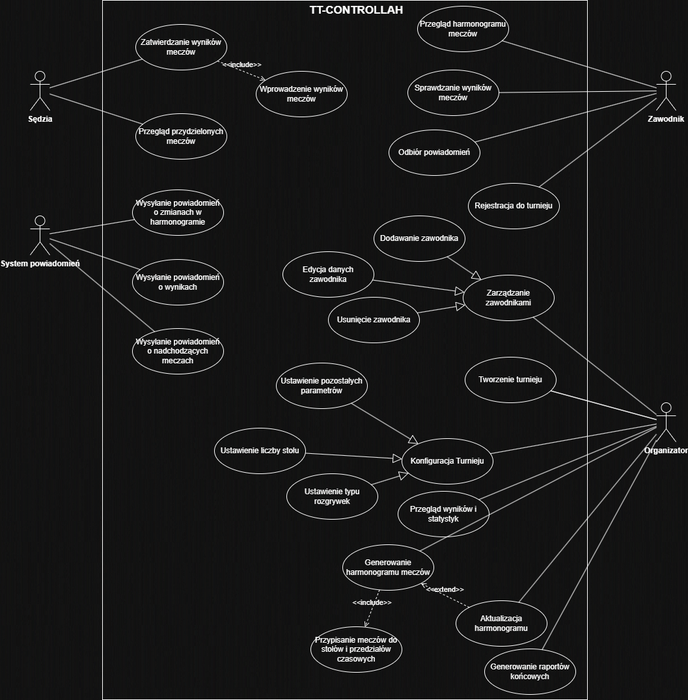
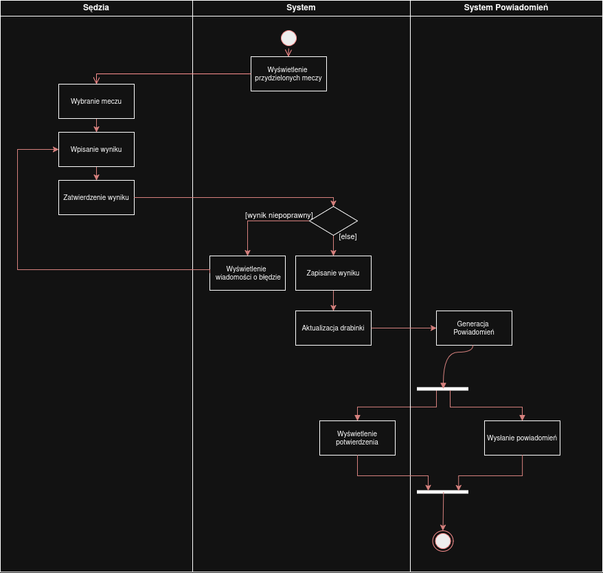
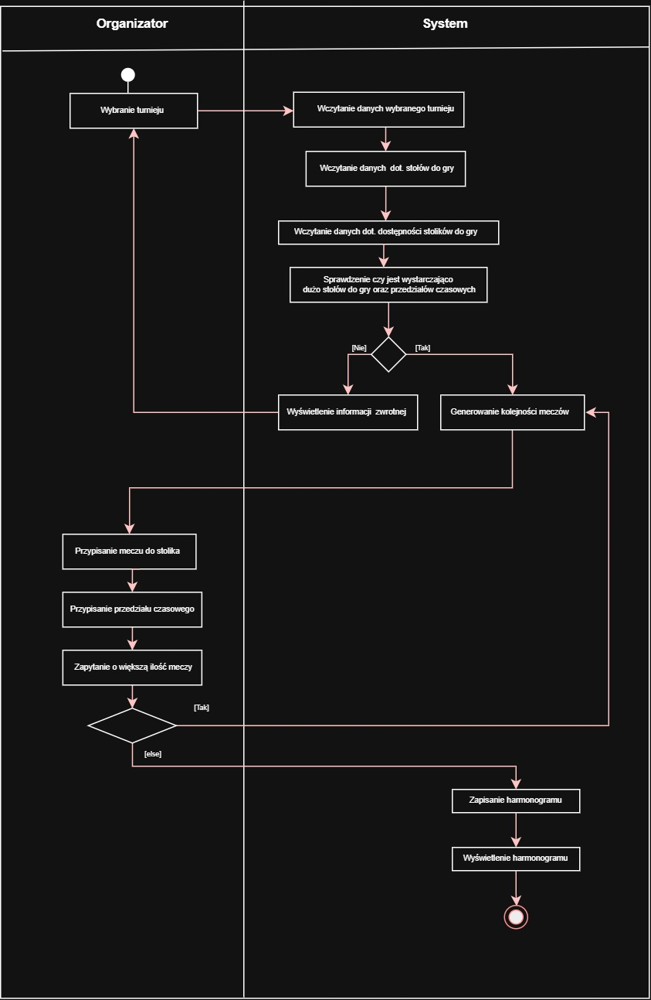
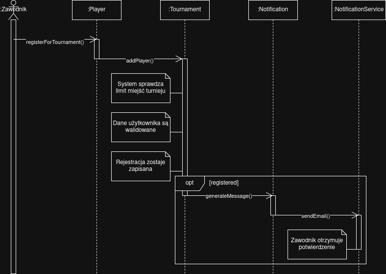
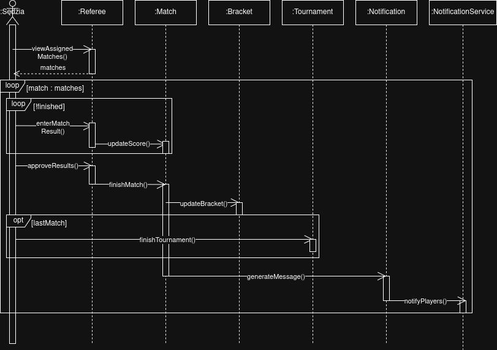
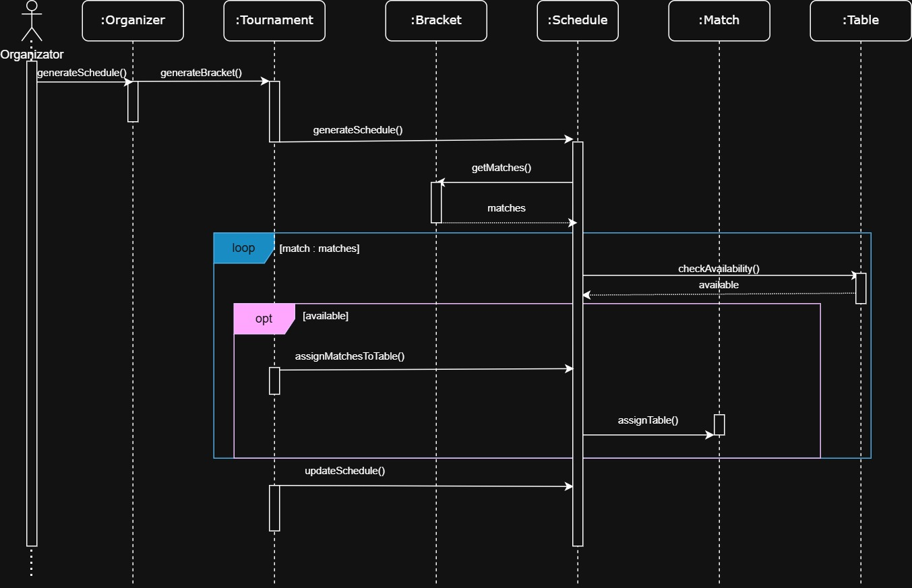
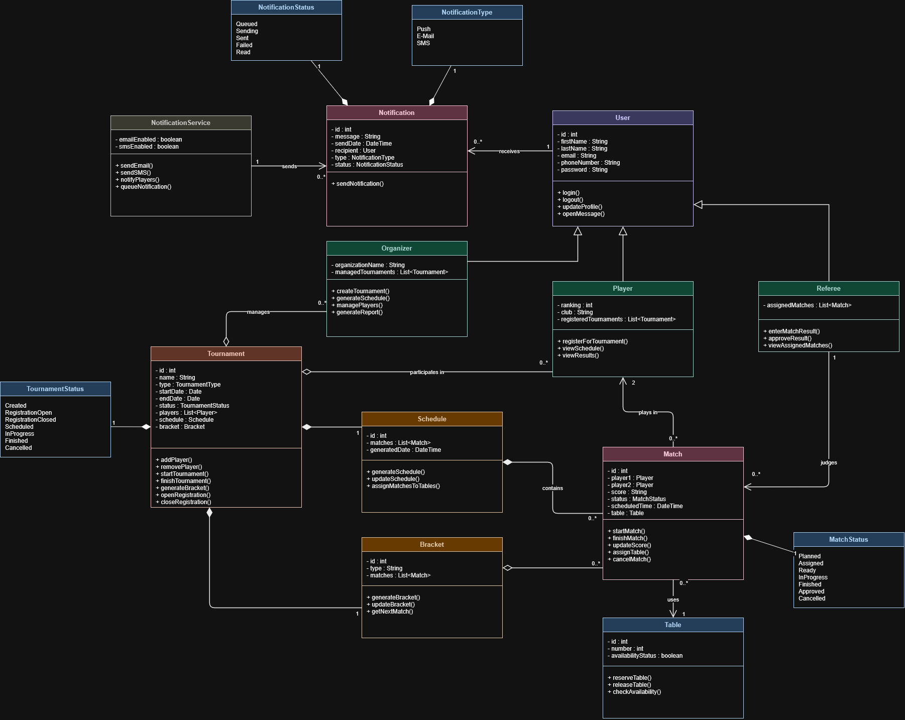

| Wydział Informatyki Politechniki Białostockiej   Inżynieria Oprogramowania Informatyka, Semestr IV, PS #1                              | Data przekazania:                            |
| ----------------------------------------------------------------------------------------------------------------------------------------------- | -------------------------------------------- |
| **Projekt**: System zarządzania zawodami w tenisa stołowego **Zespół**: - Marcel Alefierowicz - Przemysław Dudek - Michał Burzyński | **Prowadzący**: dr. inż Marcin Czajkowski |

**Repozytorium GitHub:** [tt-controllah](https://github.com/ComradeHonk/tt-controllahh)

# 1. Treść zadania

Celem projektu jest zaprojektowanie systemu informatycznego wspierającego organizację zawodów w tenisa stołowego. System ma usprawnić proces zarządzania turniejami poprzez automatyzację planowania rozgrywek, obsługi uczestników oraz publikacji wyników.

Zakres projektu obejmuje funkcjonalności związane z tworzeniem i konfiguracją turniejów, rejestracją zawodników oraz generowaniem harmonogramu meczów. System umożliwia automatyczne tworzenie drabinek turniejowych (np. pucharowych lub grupowych), przypisywanie spotkań do dostępnych stołów oraz zarządzanie przebiegiem rozgrywek w czasie rzeczywistym. Dodatkowo przewiduje się możliwość wprowadzania wyników meczów przez sędziów oraz ich natychmiastową aktualizację w systemie.

Projekt obejmuje także funkcje przeglądania harmonogramu, sprawdzania wyników oraz informowania uczestników o nadchodzących meczach i zmianach organizacyjnych. System ma wspierać organizatora w nadzorowaniu przebiegu zawodów oraz zapewniać uczestnikom szybki dostęp do aktualnych informacji.

# 2. Cel, zakres, kontekst i korzyści

## 2.1. Cel budowania systemu

Celem projektowanego systemu jest stworzenie narzędzia informatycznego wspierającego planowanie oraz zarządzanie zawodami w tenisa stołowego. 

System ma umożliwiać sprawną organizację turniejów poprzez automatyzację kluczowych procesów, takich jak rejestracja zawodników, tworzenie harmonogramu rozgrywek, zarządzanie meczami oraz publikacja wyników. Głównym założeniem jest eliminacja problemów wynikających z ręcznego zarządzania zawodami (np. błędów w harmonogramie, opóźnień, braku aktualnych informacji), a także zwiększenie przejrzystości i efektywności organizacyjnej.

## 2.2. Zakres systemu

### 2.2.1. Zakres funkcjonalny

**System obejmuje następujące funkcjonalności:**

- tworzenie i konfiguracja turniejów (np. typ rozgrywek, liczba stołów),
- rejestracja i zarządzanie zawodnikami,
- generowanie drabinek turniejowych (pucharowych, grupowych),
- automatyczne planowanie harmonogramu meczów,
- przypisywanie meczów do stołów i przedziałów czasowych,
- wprowadzanie i zatwierdzanie wyników meczów,
- aktualizacja drabinki i postępu turnieju w czasie rzeczywistym,
- przegląd harmonogramu i wyników przez użytkowników,
- wysyłanie powiadomień o meczach i zmianach,
- generowanie raportów końcowych.

### 2.2.2. Zakres niefunkcjonalny
- dostępność systemu w trakcie zawodów (wysoka niezawodność),
- czas odpowiedzi systemu poniżej 2 sekund,
- obsługa wielu użytkowników jednocześnie,
- bezpieczeństwo danych użytkowników,
- dostępność na urządzeniach mobilnych.

## 2.3. Kontekst systemu

System funkcjonuje jako centralna platforma wspierająca organizację turnieju.

### 2.3.1. Aktorzy systemu (4):
1. Organizator – zarządza turniejem i jego przebiegiem  
2. Zawodnik – uczestniczy w zawodach i przegląda informacje  
3. Sędzia – wprowadza wyniki meczów  
4. System powiadomień – wysyła komunikaty do użytkowników  

System może współpracować z zewnętrznymi usługami (np. e-mail/SMS) w celu realizacji powiadomień.

## 2.4. Przewidywalne mierzalne korzyści

### 2.4.1. Skrócenie czasu przygotowania turnieju

- przed wdrożeniem: 4–6 godzin  
- po wdrożeniu: ok. 30 minut  

### 2.4.2. Redukcja liczby błędów w harmonogramie / podczas zapisywania użytkowników

- metryka: liczba błędów / turniej  
- przed: 10–15  
- po: 0–2  

### 2.4.3. Skrócenie czasu publikacji wyników

- przed: 10–15 minut  
- po: <10 sekund  

### 2.4.4. Wzrost liczby obsługiwanych zawodników

- przed: 64 zawodników  
- po: 96 zawodników  

## 2.5. Niemierzalne korzyści

- poprawa organizacji i przejrzystości zawodów,
- zwiększenie satysfakcji uczestników,
- lepsza komunikacja między organizatorem a zawodnikami,
- większy profesjonalizm wydarzenia,
- łatwiejsze zarządzanie przebiegiem turnieju w czasie rzeczywistym.

# 3. Słownik

- **Turniej** 
Zdarzenie sportowe obejmujące zestaw rozgrywek pomiędzy zawodnikami według określonego systemu.

- **Zawodnik** 
Osoba biorąca udział w turnieju.

- **Klub** 
Jednostka organizacyjna zrzeszająca zawodników.

- **Mecz** 
Jednostka rywalizacji pomiędzy dwoma zawodnikami. Składa się z setów.

- **Set** 
Część meczu, rozgrywana do określonej liczby punktów (np. 11).

- **Punkt** 
Najmniejsza jednostka punktacji przyznawana w trakcie seta.

- **Wynik meczu** 
Rezultat meczu wyrażony najczęściej liczbą wygranych setów przez zawodników.

- **Faza turnieju** 
Logiczny etap turnieju (np. grupowa, pucharowa).

- **Grupa** 
Zbiór zawodników w fazie grupowej, rywalizujących systemem „każdy z każdym”.

- **Runda** 
Etap w fazie pucharowej (np. ćwierćfinał, półfinał).

- **Drabinka turniejowa** 
Struktura odwzorowująca przebieg fazy pucharowej i zależności między meczami.

- **System rozgrywek** 
Zasady organizacji turnieju (np. grupowy, pucharowy, mieszany).

- **Ranking** 
Uporządkowana lista zawodników według wyników lub punktów.

- **Rozstawienie (seedowanie)** 
Przypisanie zawodników do pozycji startowych w drabince na podstawie rankingu.

- **Walkower** 
Specjalny przypadek zakończenia meczu bez rozegrania.

- **Stół** 
Zasób fizyczny, na którym rozgrywany jest mecz.

# 4. Perspektywa przypadków użycia

## 4.1. Diagram przypadków użycia

### 4.1.1. Opis aktorów

**Organizator**

Organizator to główny użytkownik systemu odpowiedzialny za przygotowanie i nadzorowanie przebiegu turnieju. Tworzy i konfiguruje zawody, określając ich parametry (np. typ rozgrywek, liczba stołów), zarządza listą zawodników oraz inicjuje generowanie drabinek i harmonogramu meczów. W trakcie turnieju monitoruje jego przebieg, wprowadza ewentualne zmiany organizacyjne i dba o poprawność oraz aktualność danych. Ma najszersze uprawnienia w systemie.

**Zawodnik**

Zawodnik to uczestnik turnieju, który korzysta z systemu głównie w celu uzyskania informacji. Może zarejestrować się do zawodów, przeglądać harmonogram swoich meczów oraz sprawdzać wyniki i postęp turnieju. Otrzymuje również powiadomienia dotyczące nadchodzących spotkań i zmian organizacyjnych. Jego dostęp do systemu jest ograniczony do funkcji informacyjnych.

**Sędzia**

Sędzia odpowiada za obsługę meczów od strony wyników. Ma dostęp do listy przypisanych mu spotkań i wprowadza ich rezultaty do systemu. Może również zatwierdzać wyniki, co powoduje ich oficjalne uwzględnienie w drabince turniejowej. Jego działania mają bezpośredni wpływ na aktualizację przebiegu rozgrywek, dlatego wymagają odpowiedniej dokładności i terminowości.

**System powiadomień**

System powiadomień to aktor techniczny odpowiedzialny za komunikację z użytkownikami. Automatycznie wysyła informacje o nadchodzących meczach, zmianach w harmonogramie oraz wynikach spotkań za pośrednictwem zewnętrznych usług (np. e-mail lub SMS). Działa w tle i nie wymaga bezpośredniej interakcji ze strony użytkowników, ale odgrywa istotną rolę w zapewnieniu aktualności i dostępności informacji.

### 4.1.2. Opisy przypadków użycia

#### **Opis przypadku użycia „Rejestracja zawodnika do turnieju”** *(autor: Marcel Alefierowicz)*

**1. Uczestniczący aktorzy**

- Zawodnik

**2. Podstawowy ciąg zdarzeń**

- System wyświetla formularz rejestracji do turnieju,
- Zawodnik wprowadza wymagane dane (np. imię, nazwisko, dane kontaktowe),
- Zawodnik wybiera turniej, do którego chce się zapisać,
- Zawodnik zatwierdza formularz rejestracyjny,
- System weryfikuje kompletność i poprawność danych,
- System sprawdza dostępność miejsc w turnieju,
- System zapisuje zgłoszenie w bazie danych,
- System informuje o poprawnym zarejestrowaniu zawodnika.

**3. Alternatywne ciągi zdarzeń**

a) Dane są niekompletne lub niepoprawne
- System wyświetla formularz ponownie, wskazując błędne pola,
- Zawodnik poprawia dane i ponownie zatwierdza formularz,

b) Brak wolnych miejsc w turnieju
- System informuje o braku dostępnych miejsc,
- Zawodnik może wybrać inny turniej lub anulować operację,

c) Zawodnik rezygnuje z rejestracji
- System przerywa proces bez zapisywania danych.

**4. Zależności czasowe**

a) częstotliwość wykonania: zależna od liczby uczestników, zwykle kilkanaście–kilkadziesiąt razy na turniej 
b) przewidywane spiętrzenia: przed rozpoczęciem turnieju 
c) typowy czas realizacji: ~1–2 minuty 
d) maksymalny czas realizacji: nieokreślony 

**5. Wartości uzyskiwane przez aktora po zakończeniu przypadku użycia**
- Potwierdzenie rejestracji do turnieju,
- Zapis w systemie jako uczestnik zawodów,
- Możliwość udziału w rozgrywkach.

#### **Opis przypadku użycia „Wprowadzanie i zatwierdzanie wyników meczów”** *(autor: Michał Burzyński)*

**1. Uczestniczący aktorzy**

- Sędzia

**2. Podstawowy ciąg zdarzeń**

- System wyświetla listę meczów przypisanych do Sędziego,
- Sędzia wybiera zakończony mecz,
- System wyświetla formularz wprowadzania wyniku,
- Sędzia wprowadza wynik meczu,
- Sędzia zatwierdza wynik,
- System weryfikuje poprawność danych (np. format wyniku),
- System zapisuje wynik w bazie danych,
- System automatycznie aktualizuje drabinkę turniejową i status rozgrywek,
- System informuje o poprawnym zapisaniu wyniku.

**3. Alternatywne ciągi zdarzeń**

a) Wprowadzone dane są niepoprawne
- System wyświetla komunikat o błędzie i wskazuje niepoprawne pola,
- Sędzia poprawia dane i ponownie zatwierdza wynik,

b) Sędzia rezygnuje z wprowadzania wyniku
- System przerywa operację bez zapisywania danych.

**4. Zależności czasowe**

a) częstotliwość wykonania: wielokrotnie w trakcie turnieju 
b) przewidywane spiętrzenia: w końcowych fazach turnieju 
c) typowy czas realizacji: ~30 sekund 
d) maksymalny czas realizacji: nieokreślony 

**5. Wartości uzyskiwane przez aktora po zakończeniu przypadku użycia**

- Zapisany i zatwierdzony wynik meczu,
- Aktualizacja drabinki turniejowej,
- Informacja o poprawnym wykonaniu operacji.

#### **Opis przypadku użycia „Generowanie harmonogramu meczów”** *(autor: Przemysław Dudek)*

**1. Uczestniczący aktorzy**

- Organizator

**2. Podstawowy ciąg zdarzeń**

- System wyświetla opcję generowania harmonogramu meczów,
- Organizator wybiera turniej oraz parametry harmonogramu (np. liczba stołów, dostępne przedziały czasowe),
- System pobiera dane o zawodnikach oraz wygenerowanej drabince turniejowej,
- System analizuje dostępne zasoby (stoły, czas),
- System automatycznie generuje harmonogram meczów, przypisując spotkania do stołów i przedziałów czasowych,
- System zapisuje harmonogram w bazie danych,
- System wyświetla wygenerowany harmonogram Organizatorowi.

**3. Alternatywne ciągi zdarzeń**

a) Brak wystarczających zasobów (np. za mało stołów lub czasu)
- System informuje o problemie i sugeruje zmianę parametrów,
- Organizator modyfikuje dane i ponownie uruchamia generowanie harmonogramu,

b) Organizator rezygnuje z operacji
- System przerywa proces i wraca do poprzedniego stanu bez zapisywania danych.

**4. Zależności czasowe**

a) częstotliwość wykonania: 1–2 razy na turniej 
b) przewidywane spiętrzenia: przed rozpoczęciem zawodów 
c) typowy czas realizacji: kilka sekund 
d) maksymalny czas realizacji: do kilkunastu sekund 

**5. Wartości uzyskiwane przez aktora po zakończeniu przypadku użycia**

- Gotowy harmonogram meczów,
- Przypisanie spotkań do stołów i godzin,
- Możliwość dalszego zarządzania turniejem.

## 4.2. Diagramy czynności

### 4.2.1. Diagram czynności „Rejestracja zawodnika do turnieju” *(autor: Marcel Alefierowicz)*

### 4.2.2. Diagram czynności „Wprowadzanie i zatwierdzanie wyników meczów” *(autor: Michał Burzyński)*

### 4.2.3. Diagram czynności „Generowanie harmonogramu meczów” *(autor: Przemysław Dudek)*

## 4.3. Diagramy interakcji (przebiegu)

### 4.3.1. Diagram interakcji „Rejestracja zawodnika do turnieju” *(autor: Marcel Alefierowicz)*

### 4.3.2. Diagram interakcji „Wprowadzanie i zatwierdzanie wyników meczów” *(autor: Michał Burzyński)*

### 4.3.3. Diagram interakcji „Generowanie harmonogramu meczów” *(autor: Przemysław Dudek)*

# 5. Perspektywa projektowa
## 5.1 Diagram klas

## 5.2 Uporządkowany alfabetycznie wykaz wszystkich klas

#### Bracket

**Opis:**

Klasa odpowiedzialna za reprezentację drabinki turniejowej oraz zarządzanie jej strukturą.

**Atrybuty:**

- `id : int` — unikalny identyfikator drabinki
- `type : String` — typ drabinki (np. knockout, group)
- `matches : List<Match>` — lista meczów w drabince

**Metody:**

- `generateBracket()` — generuje strukturę drabinki
- `updateBracket()` — aktualizuje drabinkę po zakończeniu meczu
- `getNextMatch()` — zwraca kolejny mecz w drabince

#### Match

**Opis:**

Klasa reprezentująca pojedynczy mecz rozgrywany w turnieju.

**Atrybuty:**

- `id : int` — identyfikator meczu
- `player1 : Player` — pierwszy zawodnik
- `player2 : Player` — drugi zawodnik
- `score : String` — wynik meczu
- `status : MatchStatus` — status meczu
- `scheduledTime : DateTime` — zaplanowany czas meczu
- `table : Table` — przypisany stół

**Metody:**

- `startMatch()` — rozpoczyna mecz
- `finishMatch()` — kończy mecz
- `updateScore()` — aktualizuje wynik meczu
- `assignTable()` — przypisuje stół do meczu

#### Notification

**Opis:**

Klasa odpowiedzialna za reprezentację powiadomień wysyłanych do użytkowników.

**Atrybuty:**

- `id : int` — identyfikator powiadomienia
- `message : String` — treść powiadomienia
- `sendDate : DateTime` — data wysłania
- `recipient : User` — odbiorca powiadomienia
- `type : NotificationType` — typ powiadomienia

**Metody:**

- `sendNotification()` — wysyła powiadomienie
- `generateMessage()` — tworzy treść komunikatu

#### NotificationService

**Opis:**

Klasa realizująca wysyłanie powiadomień przez zewnętrzne kanały komunikacji.

**Atrybuty:**

- emailEnabled : boolean — określa dostępność wysyłki e-mail
- smsEnabled : boolean — określa dostępność wysyłki SMS

**Metody:**

- `sendEmail()` — wysyła wiadomość e-mail
- `sendSMS()` — wysyła wiadomość SMS
- `notifyPlayers()` — wysyła powiadomienia do zawodników

#### Organizer

**Opis:**

Klasa reprezentująca organizatora odpowiedzialnego za zarządzanie turniejem.

**Atrybuty:**

- `organizationName : String` — nazwa organizacji
- `managedTournaments : List<Tournament>` — lista zarządzanych turniejów

**Metody:**

- `createTournament()` — tworzy nowy turniej
- `generateSchedule()` — uruchamia generowanie harmonogramu
- `managePlayers()` — zarządza zawodnikami
- `generateReport()` — generuje raport końcowy

#### Player

**Opis:**

Klasa reprezentująca zawodnika uczestniczącego w turnieju.

**Atrybuty:**

- `ranking : int` — ranking zawodnika
- `club : String` — klub zawodnika
- `registeredTournaments : List<Tournament>` — lista turniejów zawodnika

**Metody:**

- `registerForTournament()` — rejestruje zawodnika do turnieju
- `viewSchedule()` — wyświetla harmonogram meczów
- `viewResults()` — wyświetla wyniki turnieju

#### Referee

**Opis:**

Klasa reprezentująca sędziego odpowiedzialnego za obsługę wyników meczów.

**Atrybuty:**

- `assignedMatches : List<Match>` — lista przypisanych meczów

**Metody:**

- `enterMatchResult()` — wprowadza wynik meczu
- `approveResult()` — zatwierdza wynik meczu
- `viewAssignedMatches()` — wyświetla przypisane mecze

#### Schedule

**Opis:**

Klasa odpowiedzialna za harmonogram rozgrywek turniejowych.

**Atrybuty:**

- `id : int` — identyfikator harmonogramu
- `matches : List<Match>` — lista zaplanowanych meczów
- `generatedDate : DateTime` — data wygenerowania harmonogramu

**Metody:**

- `generateSchedule()` — tworzy harmonogram meczów
- `updateSchedule()` — aktualizuje harmonogram
- `assignMatchesToTables()` — przypisuje mecze do stołów

#### Table

**Opis:**

Klasa reprezentująca stół do gry wykorzystywany podczas turnieju.

**Atrybuty:**

- `id : int` — identyfikator stołu
- `number : int` — numer stołu
- `availabilityStatus : boolean` — dostępność stołu

**Metody:**

- `reserveTable()` — rezerwuje stół
- `releaseTable()` — zwalnia stół
- `checkAvailability()` — sprawdza dostępność stołu

#### Tournament

**Opis:**

Klasa reprezentująca turniej tenisa stołowego.

**Atrybuty:**

- `id : int` — identyfikator turnieju
- `name : String` — nazwa turnieju
- `type : TournamentType` — typ turnieju
- `startDate : Date` — data rozpoczęcia
- `endDate : Date` — data zakończenia
- `status : TournamentStatus` — status turnieju
- `players : List<Player>` — lista zawodników
- `schedule : Schedule` — harmonogram turnieju
- `bracket : Bracket` — drabinka turniejowa

**Metody:**

- `addPlayer()` — dodaje zawodnika do turnieju
- `removePlayer()` — usuwa zawodnika z turnieju
- `startTournament()` — rozpoczyna turniej
- `finishTournament()` — kończy turniej
- `generateBracket()` — generuje drabinkę turniejową

#### User

**Opis:**

Klasa bazowa reprezentująca użytkownika systemu.

**Atrybuty:**

- `id : int` — identyfikator użytkownika
- `firstName : String` — imię użytkownika
- `lastName : String` — nazwisko użytkownika
- `email : String` — adres e-mail
- `phoneNumber : String` — numer telefonu
- `password : String` — hasło użytkownika

**Metody:**

- `login()` — logowanie użytkownika
- `logout()` — wylogowanie użytkownika
- `updateProfile()` — aktualizacja danych użytkownika
## 5.4. Propozycje interfejsu użytkownika
**Link do wygenerowanej strony:** [Bolt.new](https://table-tennis-tournam-feqg.bolt.host/)
